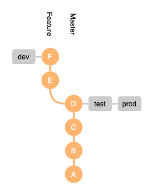

# GitHub Flow with GitHub Actions

This is a simple proof of concept that enables the use of GitHub Flow with GitHub Actions. It intends to support immutable builds and image promotions. Further, the state of the origin repo gives a full picture of the state of deployment environments.

## Objective

The objective of this repo is to enable GitHub Flow using GitHub Actions. The difficulty of this resides mostly in 

## GitHub Flow Overview

Github Flow describes a workflow for a simple software projects that have only a single instance deployed at once. It aims to get features and bug fixes deployed as quickly as possible.

The `master` branch is intended to be completely stable. To enable this, feature branches are cut from `master`, worked on and committed to, and finally pushed to the development environment. The feature branch can even be prmoted through to prod before it is accepted. The feature branch is then merged back into `master`.

With GitHub Flow, there are no `dev`, `staging`, or `test` banches. The only long-lived branch is `master`.

## Immutable Builds

Immutable builds require a single build for a version of the application. This image is then moved, or promoted, though multiple test environments until it arrives in the production environment. With immutable builds, the only difference between environments is often environments variables.

Immutable builds ensure minimal differences between what is tested in pre-production environments and the final production deployment.

## Git Usage

Because `master` is always in a stable state, all branches should be cut from the latest `master`. Upon a new commit to `master`, all feature branches should be rebased. This allows code reviewers to easily get a sense of the work that has happened within a given feature branch.

When a feature branch has been built, deployed, tested, and accepted, it should be squashed and merged back into `master`. This ensures `master` maintains a linear commit history. Each feature will produce a single commit in `master` and can therefore be easily reverted on discovery of an error.

## Shared Build Environment

In order to decrease the risks involved with developers building releases on their own machines, a communal build server is used. In this example, GitHub Actions provides the shared build environment.

## Environment Representation in Git

This example uses git tags to trigger deployments and promotions. Specifically, the two tags `dev` and `prod` are used. When one of these tags is pushed to the remote repo, one of the following two things happen.

Because tags are used to build and deploy, a team can be informed of the state of deployment environments using the repo alone. This allows for easily distinguishing which features are in development, test, and productions environments.

In the above example, we can see that commit with has `D` is deployed to both the test and prod environments, while commit `F` of the feature branch is deployed to the dev environment.

### Build

When the `dev` tag is pushed, a build should be triggered. This build is tagged with a the current commit hash and pushed to the DockerHub image registry.

### Promotion

When the `test` and `prod` tags are pushed, an image promotion will take place. First, one should ensure that the image relevant to the pushed commit exists in the relevant image registry. Then, it should be tagged with the target environment e.g `-prod`. Depending on the environemnts setup, this can trigger a deployment of the pushed and tagged image to the target environemnt. 

Note that no rebuild took place during this step.

## Semantic Versioning

When images are built, they are tagged with the git commit hash. When an image is promoted to the production environment, it is tagged with an automatically-incremented [semantic version](https://semver.org). 

## Disadvantages

The state of the git repository only represents the state of deployment environments if all builds succeed. As such, GitHub Actions should be monitored for failures.

Additionally, there is currently no way to limit access to tags on GitHub. As this PoC uses tags as a trigger for and representation of deployments, all contributers with write access are able to perform deployments.

## Convenience Script

To allow developers to trigger builds and promotions from their machines, a [Makefile](Makefile) is included. This allows deployment of the currently checked-out branch and commit to be deployed or a specific commit using a commit hash.

The following commands will use the commit hash of the latest local commit by default. Alternatively, a hash can be provided using `REF=[commit hash or reference]`.

Command     | Arguments | Description
------------|-----------|------------
tag-dev     | REF       | Trigger a build in GitHub Actions and push built image to registry. The `dev` tag can be applied to any commit in the repository using the `REF` argument.
tag-prod    | REF       | Trigger a promotion to prod via GitHub Actions, will use image with the specified hash from registry. The `prod` tag can be applied to any commit in the repository using the `REF` argument. For example, if the need arrises to roll back to version `v1.2.3`, `make tag-prod REF=v1.2.3` can be run.
status      |           | Print the current branch and commit hash.
list-hashes |           | List commit hashes with associated tags and commit messages.
list-tags   |           | List tags with associated commit hashes.

